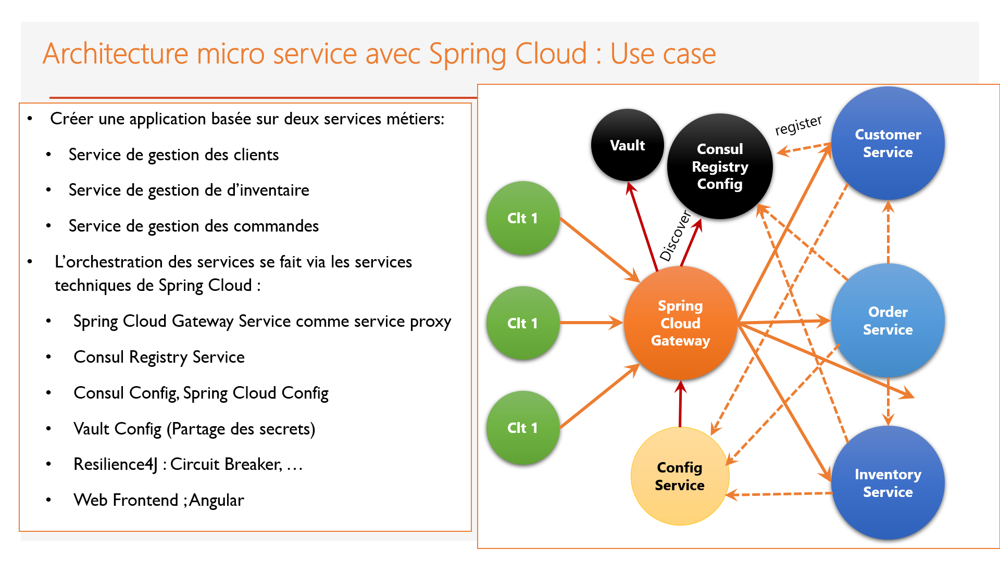
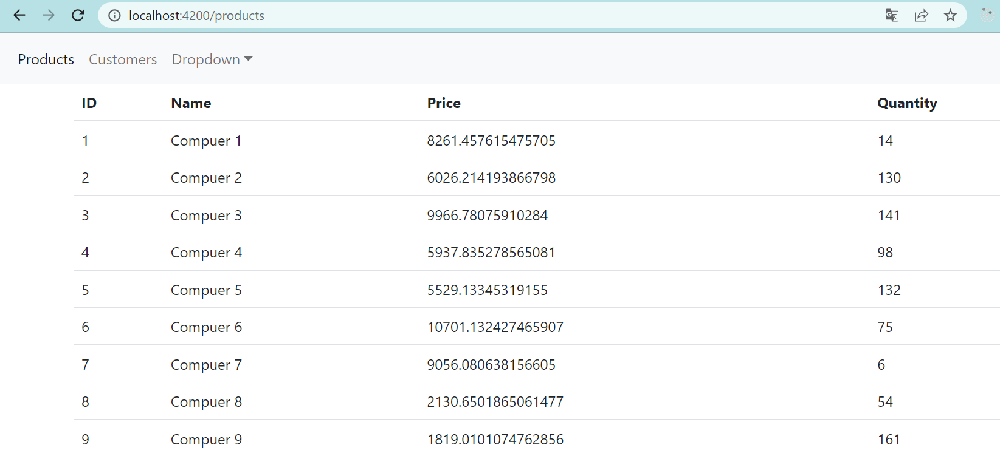
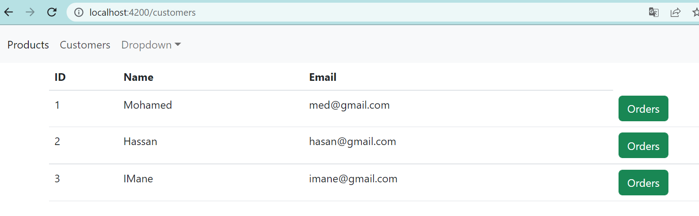
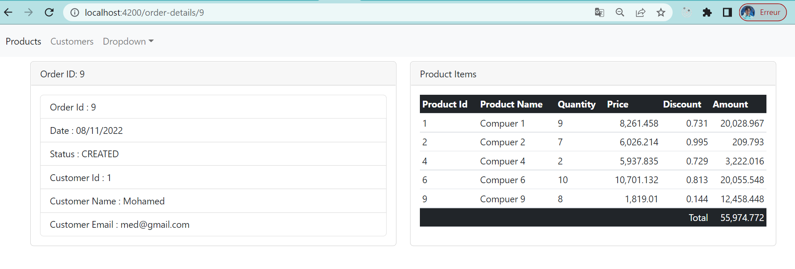

<!DOCTYPE html>
<html lang="en">
<head>
    <meta charset="UTF-8">
    <meta http-equiv="X-UA-Compatible" content="IE=edge">
    <meta name="viewport" content="width=device-width, initial-scale=1.0">
    <title>Microservices App with Consul, Spring Config, Gateway, OpenFeign, Actuator</title>
</head>
<body>

<h1>Microservices App with Consul, Spring Config, Gateway, OpenFeign, Actuator</h1>

<h2>Introduction</h2>

This is a microservices application built using Spring Cloud components, including Consul for service discovery, Spring Config for centralized configuration management, a Gateway for routing and filtering, OpenFeign for declarative REST client, and Actuator for monitoring and managing applications.

</img>

<h2>Getting Started</h2>

Before starting the application, make sure you have the following prerequisites installed:

<ul>
    <li>Java (JDK 8 or later)</li>
    <li>Maven</li>
    <li>Consul (for service discovery)</li>
</ul>

<h3>Starting Consul</h3>

Make sure Consul is running before starting the other services. You can download Consul <a href="https://www.consul.io/downloads">here</a> and follow the installation instructions for your platform.

Once installed, start Consul using the following command:

<pre><code>consul agent -dev</code></pre>

<h3>Config Service</h3>

The Config Service provides centralized configuration for the microservices. To start the Config Service, navigate to the <code>config-service</code> directory and run:

<pre><code>cd config-service
mvn spring-boot:run
</code></pre>

<h3>Other Services</h3>

Now, you can start the other microservices. Navigate to each service directory and run:

<pre><code>cd &lt;service-directory&gt;
mvn spring-boot:run
</code></pre>

Replace <code>&lt;service-directory&gt;</code> with the actual directory of each microservice.

<h2>Accessing Services</h2>

Once all services are up and running, you can access the services through the Gateway. The Gateway runs on port 8080 by default.

Example URL: <a href="http://localhost:8080/&lt;service-name&gt;/endpoint">http://localhost:8080/&lt;service-name&gt;/endpoint</a>

Replace <code>&lt;service-name&gt;</code> with the name of the microservice and <code>endpoint</code> with the specific endpoint you want to access.

<h2>Service URLs</h2>

<ul>
    <li>Consul Dashboard: <a href="http://localhost:8500">http://localhost:8500</a></li>
    <li>Config Service: <a href="http://localhost:8888">http://localhost:8888</a></li>
    <li>Gateway: <a href="http://localhost:8080">http://localhost:8080</a></li>
    <li>Other Services: Check the respective service documentation for available endpoints.</li>
</ul>

<h2>Monitoring with Actuator</h2>

Actuator endpoints provide monitoring and management features. Access Actuator endpoints for each service:

<ul>
    <li>Config Service Actuator: <a href="http://localhost:8888/actuator">http://localhost:8888/actuator</a></li>
    <li>Other Services Actuator: <a href="http://localhost:&lt;service-port&gt;/actuator">http://localhost:&lt;service-port&gt;/actuator</a></li>
</ul>

Replace <code>&lt;service-port&gt;</code> with the actual port of each microservice.

<h2>Conclusion</h2>

Your microservices application is now up and running! For more details about each service and their specific configurations, refer to the documentation in their respective directories.

<h2>images</h2>

</img>
</img>
</img>
</img>

</body>
</html>

